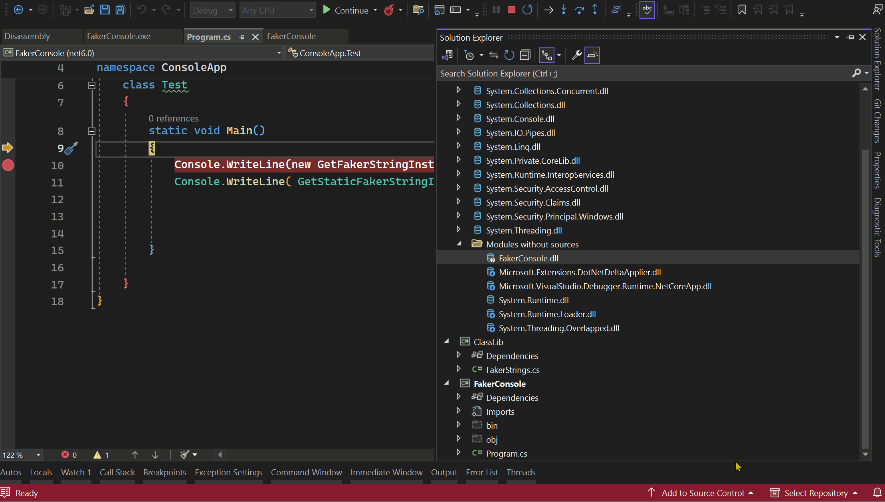

This repro was created to repro an [issue](https://github.com/oriches/faker-cs/issues/16) when [faker.net](https://github.com/oriches/faker-cs) package reference was accessed from class library though an output type project. 

